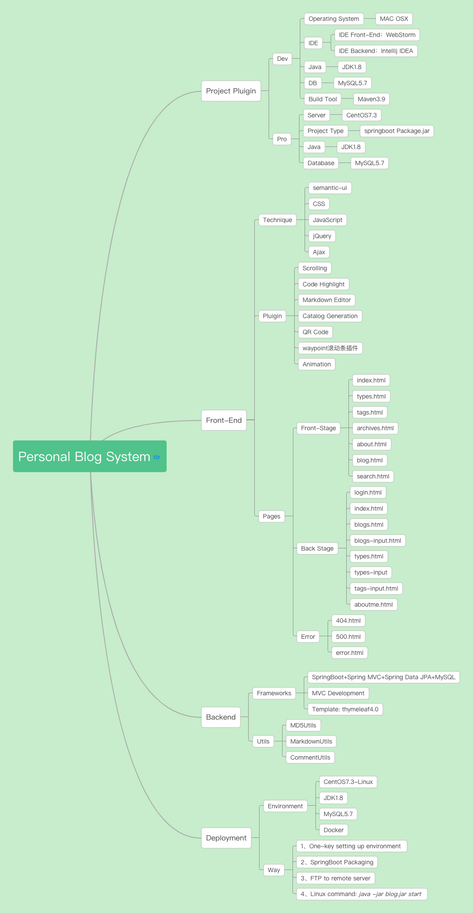
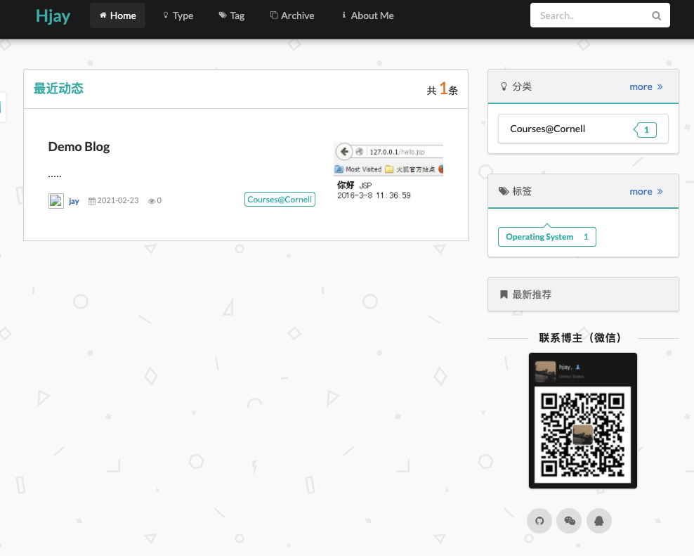
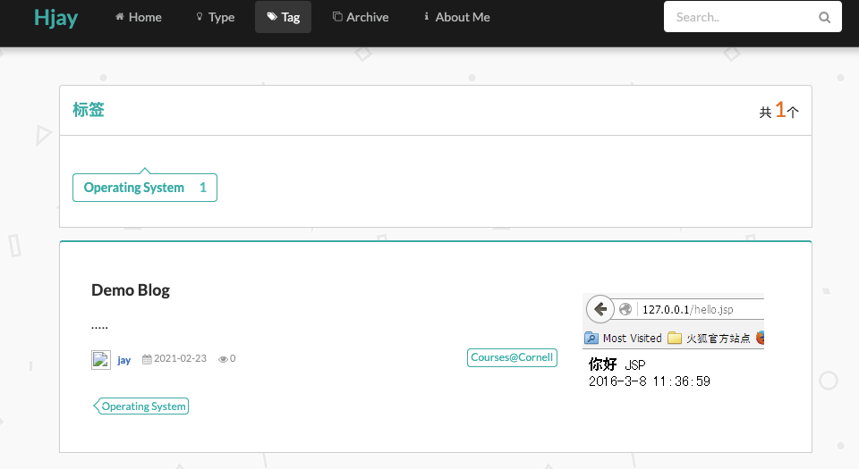
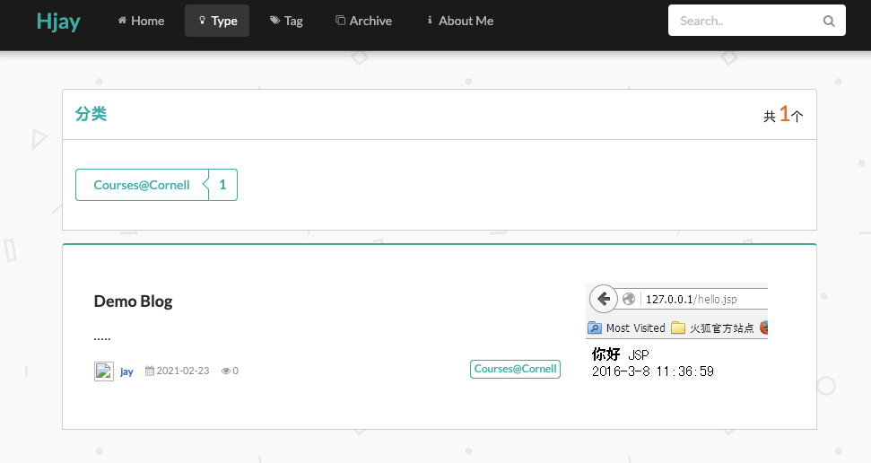
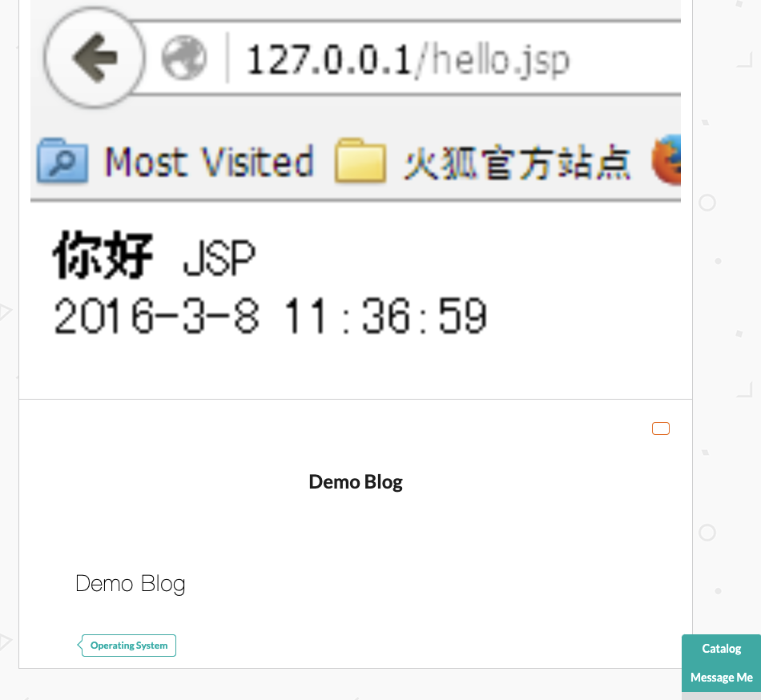
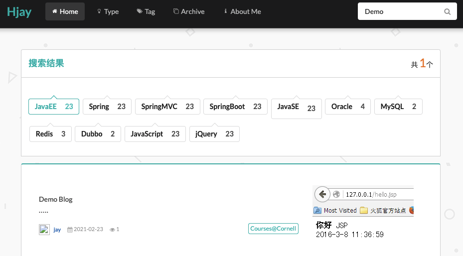
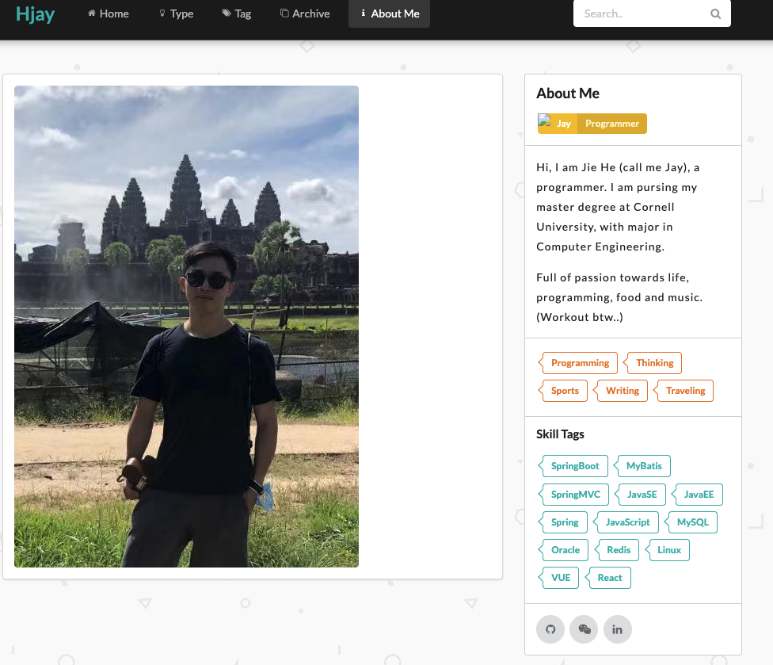
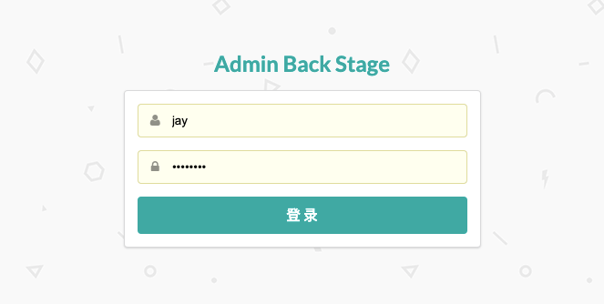
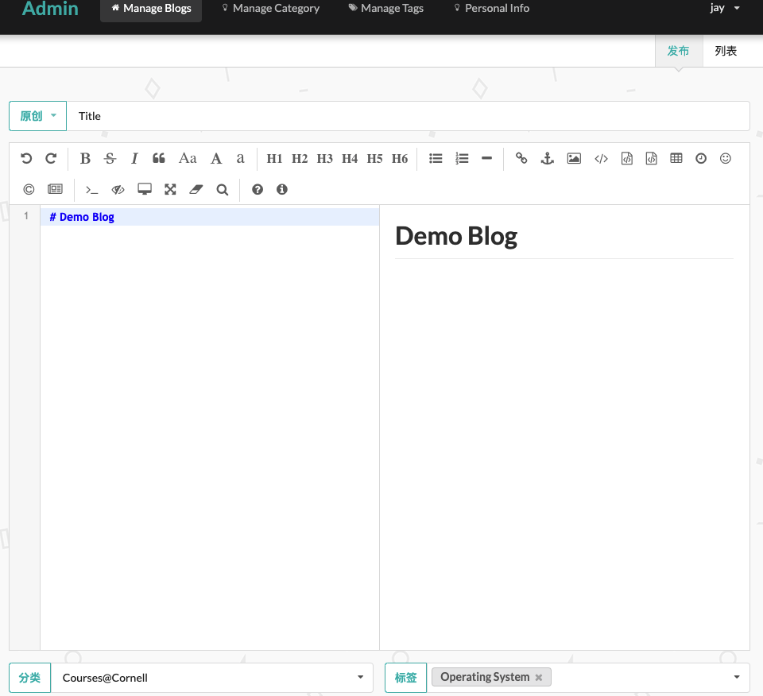
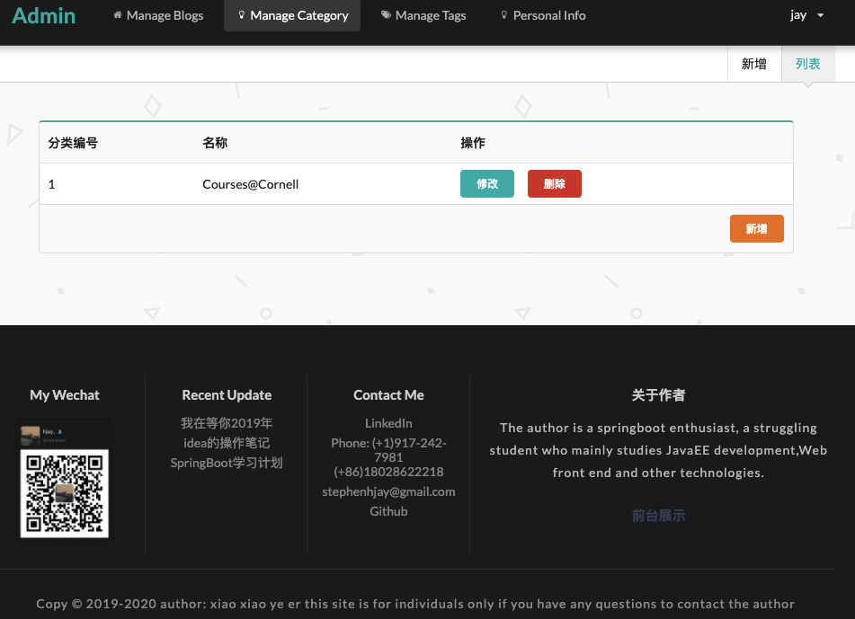

# My Blog (Beta)

* Project: Hjay's Personal Blog System  

##  Description:
This web project is intended for my personal website. It is mainly to used to share I have learnt and my life. 

I will upload my everyday learning notes and IT-related articles on it. 

Also, I am an enthusiast about food and travelling. I will update my recent activities on it.

## Built with

* Front-End: Semantic-UI, Vue
* Backend: JDK1.8 + SpringBoot + SringMVC + Spring Data JPA + MySQL5.7 (or higher)
* Build Tool: Maven

## Features:

- The front-end of this project is scaled with Semantic-UI framework due to its powerful design. The backend is built with SpringBoot.
> The whole project could be divided into front-stage (for showcase) and admin back-stage (for blogger). 
> * The front-stage has organized into seven major components: Homepage, Categories, Tags, About Me, Search Results and Blog Details;
> * Teh admin back-stage is organized into seven  big parts also, whic are User LogIn, Welcome Page, Blogs Managment, Edit/New Blog, Categories Management, Tags Editing/Add, Tags Management)
-  All the sensitive information are encrypted by AES with MD5 to improve security.

- Incorporated Markdown Utils to allow users to write blogs with markdown and automatically transform markdown text into HTML for displaying.

- Adopted Spring Data JPA to realized ORM

## Deployment 
This system is deployed on a CentOS server with Tomcat being server.

## System Analysis Xmind

## Demo Pics

## * Front Stage

## Home Page

## Blogs by Type

## Blogs By Tags

## Blog Details (Demo)

## Search Result

## About Me

## * Back Stage

### Admin Log In

### Blog Editing

### Category Management

### Tags Management

